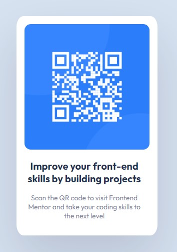

# Frontend Mentor - QR code component solution 

## My process

### Built with

- Semantic HTML5 markup
- CSS custom properties
- Flexbox

### What I learned

Con este proyecto aprendi a configurar y subir mis repositorios a GitHub pages, a la vez que mejore mi entendimiento del formato "md" para poder crear archivos README con una estructura

### Continued development

At this time I want to continue doing challenges and practices based on HTML, CSS and JS to develop a good foundation before continuing with my learning path

## Author

### Carlos Miguel Puche Moreno

- Frontend Mentor - [CMP2007](https://www.frontendmentor.io/profile/CMP2007)